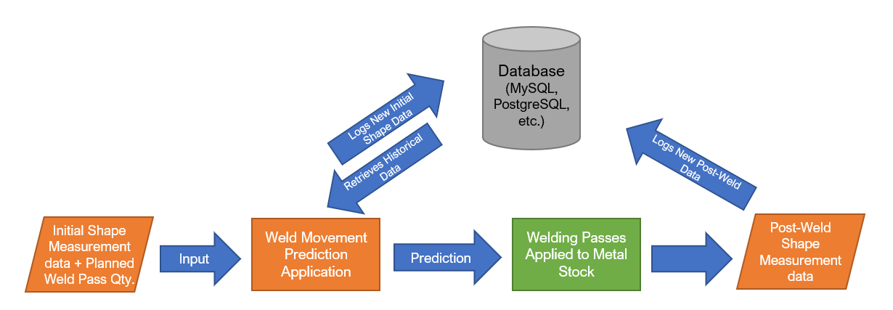
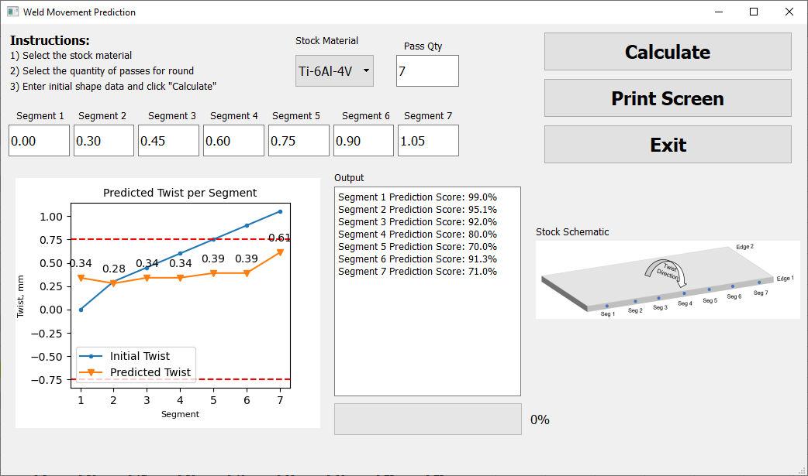

# weld-mvmt-prediction
During the fabrication of flat metal stock used for hull materials in the aerospace industry, thermal distortion is imparted to the stock.  To correct the distortion and avoid damaging the part, weld passes are applied to correct the distortion (twist).  The theory behind this practice is to create local stresses in the stock such that after cooling, the part is pulled into a shape that meets the technical requirements.  This application predicts the shape of stock after a quantity of welding passes are applied.  Regression modeling is utilized to draw inferences from historical shape data and weld pass quantities.  The application is written in python and utilizes the scikit-learn package to build a regression model using lasso regularization (LassoCV).  The structure of the application is built with machine learning in mind.  As more data is added to a database, an increase in the prediction score (coefficient of determination (R^2)) will occur over time.  The following figure presents the data flow and structure of the application.  

&nbsp;&nbsp;

&nbsp;&nbsp;

The front end is created with the PyQt5 GUI toolkit.  The Matplotlib library is embedded within the application in order to provide the user with a visualization of the post-weld condition.   The initial shape data that is recorded and later predicted after welding can be characterized as the "twist" at each station.  Twist is defined as the difference between the height measurements taken at the opposing segment locations on Edges 1 and 2 (see the Stock Schematic in the application screenshot).  The red dotted lines present the range of acceptable twist within the part (+/- 0.75 mm).  The python output is streamed into a PyQt5 text box and displays the coefficient of determination (R^2) of the prediction for each segment.  The "Print Screen" button prints a snapshot of the application window for hard copy records.

&nbsp;&nbsp;

